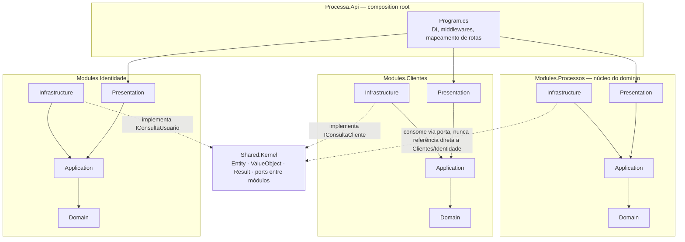

# Processa

**API de gestão operacional para escritórios de contabilidade.**

Processa é o backend de uma plataforma que centraliza processos, tarefas, documentos e comunicação com clientes — o elo que normalmente falta entre o sistema contábil (fiscal/folha) e a rotina real da equipe, hoje espalhada em planilhas, grupos de WhatsApp e e-mails soltos. Projeto **API-only**, pensado como vitrine de arquitetura e engenharia backend — sem cliente oficial.

> "O escritório sabe exatamente o que precisa ser feito, por quem, para qual cliente e até quando."

## O problema

Escritórios contábeis operam processos recorrentes e previsíveis — fechamento fiscal mensal, admissão de funcionário, abertura de empresa, entrega de obrigações acessórias — mas a maioria não tem uma ferramenta que:

- Modele esses processos como fluxos configuráveis, não como planilhas ad-hoc;
- Dê visibilidade gerencial de quem está atrasado, com quem e desde quando;
- Automatize follow-up de documentos pendentes com o cliente, sem depender de alguém lembrar de cobrar;
- Ofereça ao cliente final um portal simples para saber o que falta, sem precisar ligar para o escritório.

## A proposta

Processa é um motor de processos configurável (não um clone 1:1 de nenhum produto existente) com quatro pilares:

| Pilar | O que resolve |
|---|---|
| **Motor de processos** | Admin desenha o fluxo uma vez (etapas, responsáveis, prazos, dependências, ramificação fork/join); o motor executa e cobra a partir daí |
| **API do quadro operacional** | Endpoints de quadro por etapa (kanban), filtro composto + ordenação cumulativa + paginação e edição em massa — prontos para qualquer cliente (web, mobile, integração) consumir |
| **API do portal do cliente** | Endpoints para o cliente final enviar documento, acompanhar pendência e receber cobrança automática, sem aprender o sistema interno |
| **Motor de regras** | Automação declarativa: "se X, então Y" — escalonamento, liberação de próxima etapa, alertas de vencimento |

Multi-tenant desde o desenho: cada escritório contábil é um tenant isolado, o que torna o produto vendável como SaaS, não apenas utilizável internamente por um único escritório.

## Stack

| Camada | Tecnologia |
|---|---|
| Backend | C# 13 · ASP.NET Core 10 (LTS) (Minimal APIs + Controllers) |
| Arquitetura | Clean Architecture · Monólito modular por bounded context (DDD) |
| Banco de dados | PostgreSQL 16 · EF Core (Npgsql) |
| Cache / mensageria | Redis 7 · RabbitMQ (MassTransit) |
| Tempo real | SignalR (quadro colaborativo, notificações internas) |
| Observabilidade | OpenTelemetry (traces/métricas) · Serilog (logs estruturados) |
| Infra | Docker Compose · GitHub Actions (CI/CD) · Object Storage (S3-compatible) |
| Testes | xUnit + FluentAssertions + Testcontainers + NetArchTest |

Ver justificativa de cada escolha em [`docs/02-arquitetura/decisoes/`](docs/02-arquitetura/decisoes/).

## Arquitetura

Monólito modular: um processo, um deploy, várias fronteiras internas rígidas — cada módulo é um
bounded context com suas 4 camadas, e nunca referencia outro módulo diretamente. Regra validada
automaticamente por `Processa.ArchitectureTests` (NetArchTest) a cada build — uma violação quebra
o CI, não depende de review manual pra ser pega.



- **Domain** não depende de nada — nem de Infrastructure, nem de outro módulo.
- **Infrastructure** implementa as interfaces que Application define (repositórios, EF Core, SignalR, MinIO) — a dependência aponta pra dentro, nunca o Domain conhece o Postgres.
- Módulo A nunca importa tipo de módulo B. Quando `Processos` precisa do nome de um cliente pra montar o kanban, ele depende de uma porta (`IConsultaCliente`, definida em `Shared.Kernel`) que `Clientes` implementa — inversão de dependência, não acoplamento direto.
- O motor de execução de `Processos` (fork/join) é o núcleo do domínio: uma etapa concluída pode disparar N ramos em paralelo (fork) e uma etapa de União só libera quando todos os ramos convergem (join) — modelado como máquina de estados explícita, ver [ADR-003](docs/02-arquitetura/decisoes/adr-003-motor-de-processos-state-machine.md).

## Como rodar

```bash
cp .env.example .env        # preencher as senhas de Postgres/RabbitMQ/MinIO
docker compose up -d        # sobe postgres + redis + rabbitmq + minio, com health checks
```

```bash
# API roda no host, falando com a infra containerizada
cd backend && dotnet run --project src/Processa.Api
```

Swagger/OpenAPI disponível em `/swagger` assim que a API sobe. Detalhes em [`backend/readme.md`](backend/readme.md).

## Documentação

| Documento | Conteúdo |
|---|---|
| [`docs/00-visao-geral/`](docs/00-visao-geral/visao-do-produto.md) | Visão de produto, problema, personas e jornadas |
| [`docs/01-requisitos/`](docs/01-requisitos/requisitos-funcionais.md) | Requisitos funcionais completos e catálogo de casos de uso |
| [`docs/02-arquitetura/`](docs/02-arquitetura/visao-arquitetural.md) | Visão arquitetural (C4), ADRs numerados |
| [`docs/03-modelagem/`](docs/03-modelagem/modelo-de-dominio.md) | Modelo de domínio (DDD), modelo de dados (ERD), máquina de estados do processo |
| [`docs/04-api/`](docs/04-api/convencoes-api.md) | Convenções de API REST e catálogo de endpoints |
| [`docs/05-seguranca/`](docs/05-seguranca/politica-de-seguranca.md) | Política de segurança, autenticação, LGPD |
| [`docs/06-uml/`](docs/06-uml/diagramas.md) | Diagramas de classe e sequência dos fluxos críticos |
| [`docs/07-roadmap/`](docs/07-roadmap/roadmap-mvp.md) | Roadmap do MVP e backlog por sprint |
| [`backlog/`](backlog/README.md) | Backlog completo (14 épicos → 13 sprints → 59 itens), rastreado no Jira |

## Estrutura do repositório

```
processa/
├── backend/                              # .NET 10 — ver backend/readme.md
│   ├── src/
│   │   ├── Processa.Api/                 # composition root, controllers, middlewares
│   │   ├── Processa.Modules.Identidade/  # tenants, usuários, auth, RBAC
│   │   ├── Processa.Modules.Clientes/    # clientes, contatos, grupos
│   │   ├── Processa.Modules.Processos/   # motor de processos (núcleo do domínio)
│   │   ├── Processa.Modules.Documentos/  # upload, versionamento, aprovação
│   │   ├── Processa.Modules.Notificacoes/# e-mail, WhatsApp, interno, tempo real
│   │   ├── Processa.Modules.Portal/      # API do portal do cliente
│   │   └── Processa.Shared.Kernel/       # building blocks DDD (Entity, ValueObject, DomainEvent)
│   └── tests/
│       ├── Processa.UnitTests/           # gate de cobertura 80% (ver .csproj)
│       ├── Processa.IntegrationTests/    # WebApplicationFactory, ponta a ponta
│       └── Processa.ArchitectureTests/   # NetArchTest — valida regras de dependência do ADR-001
├── docs/
├── backlog/
├── docker/                                 # Dockerfile do backend
├── .github/workflows/                      # ci.yml (build/lint/test) + release.yml (semantic-release)
└── package.json                            # tooling de release (semantic-release) — não é o produto
```

## CI/CD

- **CI** ([`ci.yml`](.github/workflows/ci.yml)): restore, `dotnet format --verify-no-changes`, build Release, scan de vulnerabilidade (`dotnet list package --vulnerable`), testes de arquitetura/unitários/integração (Postgres via Testcontainers, MinIO e Redis sobem à parte no runner), relatório de cobertura publicado como artefato.
- **Release** ([`release.yml`](.github/workflows/release.yml)): [`semantic-release`](https://semantic-release.gitbook.io/) calcula a versão a partir de Conventional Commits — push em `develop` gera pre-release (`vX.Y.Z-dev.N`), push em `main` gera release estável (`vX.Y.Z`) com changelog automático no GitHub Releases e a imagem `ghcr.io/ruaancorrea/processa-api` publicada.

Detalhes e alternativas consideradas em [ADR-010](docs/02-arquitetura/decisoes/adr-010-ci-cd-gitflow.md).

## Status

🏗️ **Em desenvolvimento ativo** — Clean Architecture com testes de arquitetura reais (NetArchTest) validando as regras do [ADR-001](docs/02-arquitetura/decisoes/adr-001-clean-architecture-modular-monolith.md); módulos de Identidade (multi-tenancy, JWT, RBAC), Clientes e Processos (motor de execução fork/join, kanban por etapa, filtros/paginação/edição em massa, notificação em tempo real via SignalR) implementados e testados. `docker compose up` sobe Postgres/Redis/RabbitMQ/MinIO com health checks, CI + release automático no GitHub Actions. Ver progresso por sprint em [`docs/07-roadmap/backlog-sprints.md`](docs/07-roadmap/backlog-sprints.md).

## Licença

[MIT](LICENSE) — código e documentação livres para estudo e reuso.
