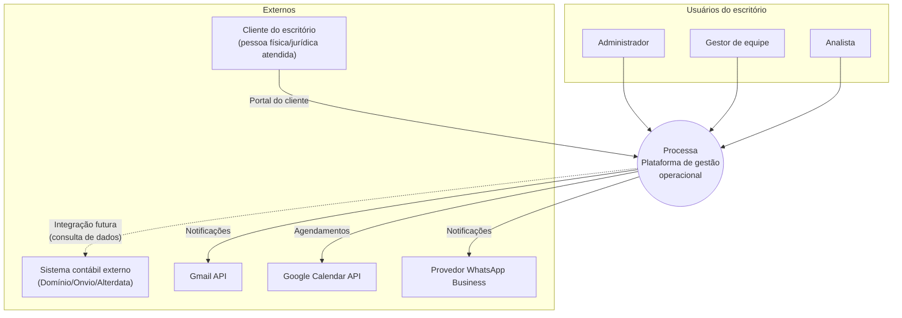
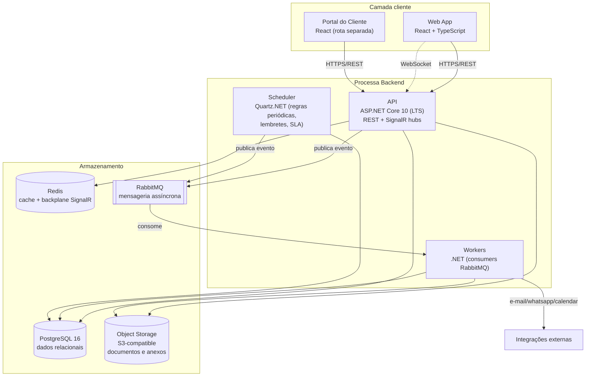
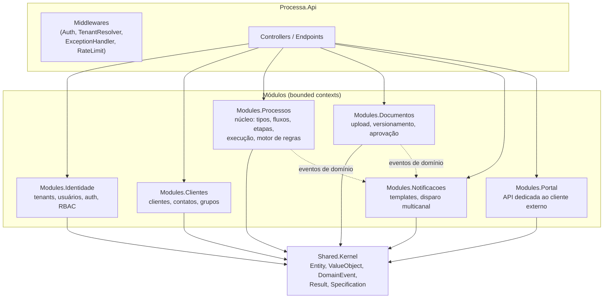
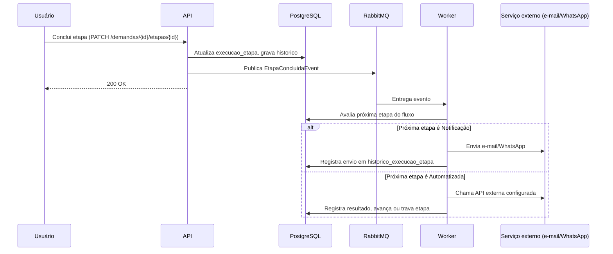

# Visão Arquitetural

## 1. Estilo arquitetural

**Monólito modular** organizado por bounded context (DDD), rodando em **Clean Architecture** por módulo — não microsserviços. Justificativa completa em [ADR-001](decisoes/adr-001-clean-architecture-modular-monolith.md).

Resumo da decisão: para o estágio do produto (MVP, equipe pequena, ainda validando product-market fit), microsserviços adicionariam custo operacional (deploy, observabilidade distribuída, consistência eventual entre serviços) sem benefício correspondente. O monólito modular entrega os mesmos limites de domínio *dentro do código* (via regras de dependência testadas automaticamente), com deploy único e possibilidade de extrair um módulo para serviço próprio no futuro, se a escala justificar.

## 2. C4 — Nível 1: Contexto



## 3. C4 — Nível 2: Containers



## 4. C4 — Nível 3: Componentes do backend (API)



Cada módulo segue internamente a mesma estrutura em camadas (Clean Architecture):

```
Modules.Processos/
├── Domain/          # Entidades, Value Objects, eventos de domínio — zero dependência externa
├── Application/     # Casos de uso (Commands/Queries via MediatR), interfaces de repositório
├── Infrastructure/  # Implementação de repositórios (EF Core), integrações externas
└── Presentation/    # Endpoints/Controllers do módulo, DTOs, mapeamento
```

Regra de dependência (validada automaticamente por testes de arquitetura — ver [ADR-001](decisoes/adr-001-clean-architecture-modular-monolith.md)): `Domain` não depende de nada; `Application` depende só de `Domain`; `Infrastructure` e `Presentation` dependem de `Application`; nenhum módulo referencia a camada `Infrastructure` de outro módulo diretamente — comunicação entre módulos é via eventos de domínio (in-process) ou pela `Application` layer exposta como contrato.

## 5. Multi-tenancy

Estratégia: **banco compartilhado, isolamento por coluna** (`tenant_id` em toda tabela com dado de tenant), com filtro global aplicado automaticamente via EF Core Global Query Filters — nenhuma query de aplicação pode "esquecer" o filtro. Ver [ADR-002](decisoes/adr-002-multi-tenancy.md) para as alternativas consideradas (schema por tenant, banco por tenant) e por que foram descartadas para o estágio atual.

## 6. Fluxo de uma automação (visão de sequência simplificada)



## 7. Decisões arquiteturais

Ver [`decisoes/`](decisoes/) para o catálogo completo de ADRs numerados.

| ADR | Decisão |
|---|---|
| [001](decisoes/adr-001-clean-architecture-modular-monolith.md) | Clean Architecture + monólito modular por bounded context |
| [002](decisoes/adr-002-multi-tenancy.md) | Multi-tenancy por coluna com Global Query Filters |
| [003](decisoes/adr-003-motor-de-processos-state-machine.md) | Motor de processos como máquina de estados explícita |
| [004](decisoes/adr-004-mensageria-rabbitmq.md) | RabbitMQ + MassTransit para eventos e automações |
| [005](decisoes/adr-005-autenticacao-multi-perfil.md) | JWT + RBAC multi-perfil, refresh token rotativo |
| [006](decisoes/adr-006-observabilidade.md) | OpenTelemetry + Serilog como padrão de observabilidade |
| [007](decisoes/adr-007-frontend-react.md) | ~~React + TypeScript + Vite no frontend~~ — *superseded, projeto é API-only* |
| [008](decisoes/adr-008-storage-documentos.md) | Object storage S3-compatible para documentos, não banco |
| [009](decisoes/adr-009-notificacoes-tempo-real-signalr.md) | SignalR para tempo real (kanban, notificações internas) |
| [010](decisoes/adr-010-ci-cd-gitflow.md) | GitFlow leve + Conventional Commits + CI obrigatório |
