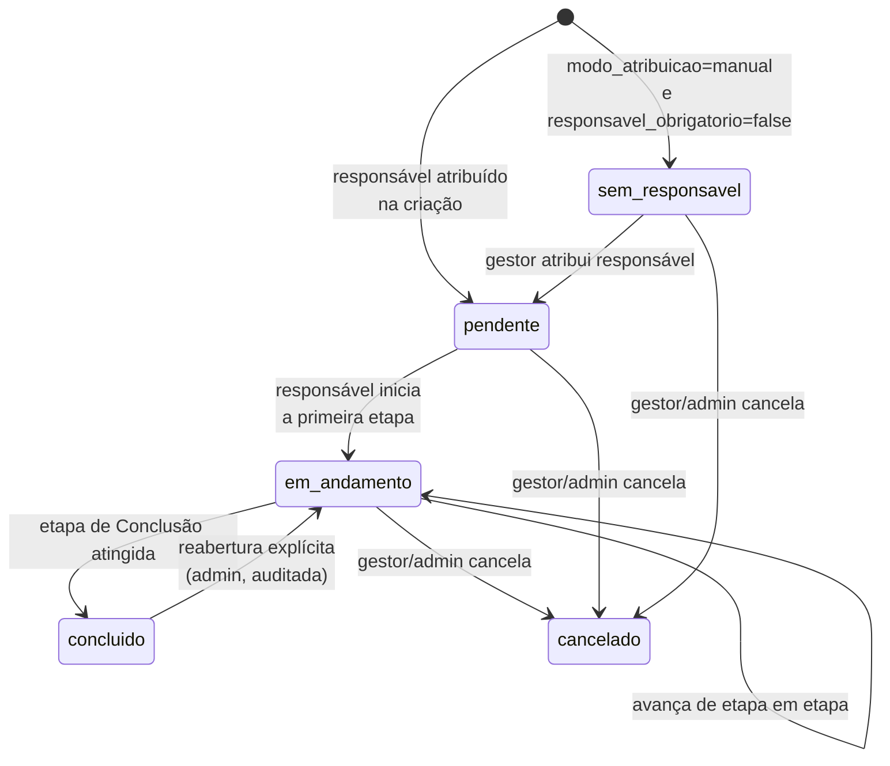
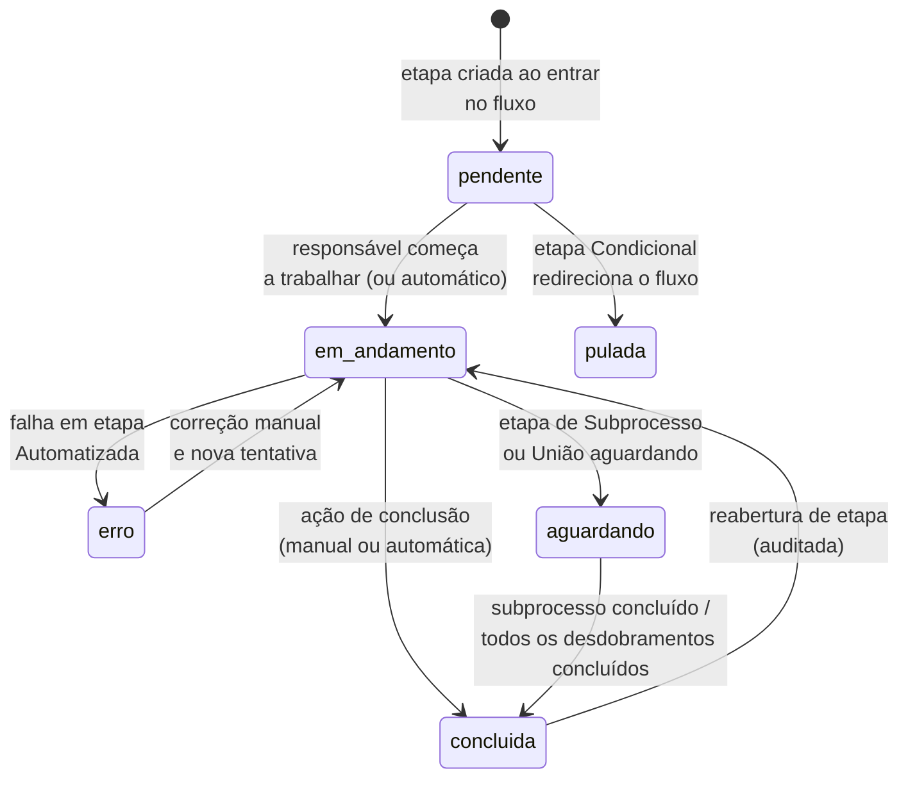
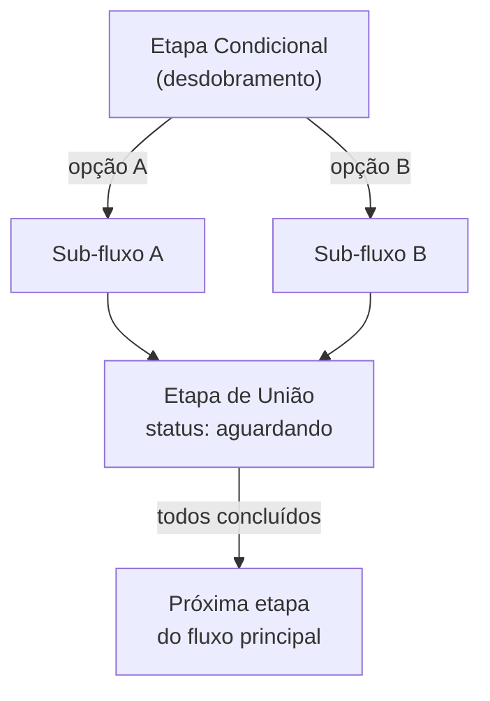

# Máquina de Estados

## 1. Status da Demanda

## 2. Status da Execução de Etapa

## 3. Transições por tipo de etapa

| Tipo de etapa | Como sai de `em_andamento` |
|---|---|
| Comum | Responsável marca manualmente como concluída ou não concluída |
| Condicional | Sistema avalia o campo configurado e decide automaticamente: próxima etapa, volta, ou outro fluxo |
| Automatizada | Resposta HTTP validada (status code ou campo JSON) → `concluida`; falha ou timeout → `erro` (trava) |
| Notificação | Disparo confirmado → `concluida` automaticamente |
| Agendamento | Modo standalone: conclusão automática na data/hora definida (via Scheduler). Modo Calendar: manual ou pós-horário do evento |
| Subprocesso | `aguardando` até a subdemanda atingir `concluido`; então `concluida` automaticamente |
| Conclusão | Ao ser atingida, marca a `Demanda` inteira como `concluido` |
| União | `aguardando` até todos os `desdobramentos_aguardados` vinculados terem `concluido=true` |

## 4. Diagrama de fork/join (etapa de União)

Toda transição acima é validada por teste unitário do respectivo `IEtapaHandler` (ver [ADR-003](../02-arquitetura/decisoes/adr-003-motor-de-processos-state-machine.md)) — nenhuma transição de estado é aceita fora das regras descritas aqui; tentativas inválidas retornam erro de domínio (`InvalidTransitionException`), nunca falham silenciosamente.
