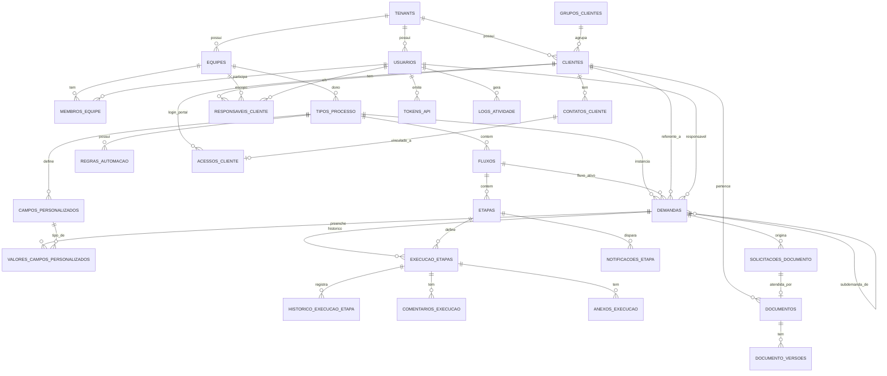

# Modelo de Dados

PostgreSQL 16. Toda tabela com dado de tenant carrega `tenant_id UUID NOT NULL` com índice composto `(tenant_id, ...)` nas colunas de busca frequente — ver [ADR-002](../02-arquitetura/decisoes/adr-002-multi-tenancy.md). UUIDs como chave primária em toda tabela. Timestamps em `TIMESTAMPTZ`.

## 1. Diagrama entidade-relacionamento (núcleo)

## 2. Tabelas principais (colunas relevantes)

### `tenants`
| Coluna | Tipo | Observação |
|---|---|---|
| id | UUID PK | |
| nome | VARCHAR(200) | Razão social do escritório |
| cnpj | VARCHAR(18) | UNIQUE |
| dominio_portal | VARCHAR(255) | opcional, subdomínio do portal do cliente |
| plano | ENUM(trial, starter, pro) | |
| status | ENUM(ativo, suspenso) | DEFAULT ativo |
| created_at / updated_at | TIMESTAMPTZ | |

### `usuarios`
id, tenant_id (FK), nome, email (UNIQUE por tenant), senha_hash (bcrypt), perfil (`admin`\|`gestor`\|`analista`), nivel_experiencia, ativo, created_at, updated_at.

### `equipes`, `membros_equipe`, `grupos_clientes`, `clientes`, `contatos_cliente`, `responsaveis_cliente`
Estrutura clássica de cadastro de escritório contábil (equipes com membros e papel, clientes com grupo/contatos, vínculo responsável-cliente por equipe), com `tenant_id` em todas as tabelas. `responsaveis_cliente` usa índice único **parcial** `(tenant_id, cliente_id, usuario_id, equipe_id) WHERE removido_em IS NULL`, permitindo reativar o mesmo vínculo após soft-delete sem violar unicidade.

### `tipos_processo`
id, tenant_id, equipe_id (FK), nome, descricao, responsavel_obrigatorio (bool), modo_atribuicao (`fixo`\|`dinamico`\|`manual`), responsavel_fixo_id (FK nullable), permissoes_inicio (JSONB), ativo, created_at, updated_at.

### `campos_personalizados`
id, tenant_id, tipo_processo_id (FK), nome, tipo (`texto`,`numero`,`data`,`lista`,`booleano`,`monetario`,`arquivo`,`usuario`), opcoes (JSONB), obrigatorio, ordem, created_at, updated_at.

### `fluxos`
id, tenant_id, tipo_processo_id (FK), nome, descricao, fluxo_padrao (bool, DEFAULT false), created_at, updated_at.
**Índice único parcial:** `(tipo_processo_id) WHERE fluxo_padrao = true` — garante um único fluxo padrão por tipo de processo. O serviço de aplicação força o primeiro fluxo criado a `fluxo_padrao=true` e desmarca os demais na mesma transação ao alterar o padrão, evitando a corrida em que um segundo fluxo criado violaria o índice.

### `etapas`
id, tenant_id, fluxo_id (FK), nome, descricao, tipo (`comum`,`condicional`,`automatizada`,`notificacao`,`agendamento`,`subprocesso`,`conclusao`,`uniao`), ordem, configuracao (JSONB, estrutura por tipo — ver [requisitos, módulo 6](../01-requisitos/requisitos-funcionais.md#6-módulo-motor-de-processos--tipos-de-etapa)), configuracao_acesso (JSONB `{"pode_alterar": [...]}`), created_at, updated_at.

### `demandas` (instâncias de processo)
id, tenant_id, tipo_processo_id (FK), fluxo_ativo_id (FK), cliente_id (FK), responsavel_id (FK nullable), status (`sem_responsavel`,`pendente`,`em_andamento`,`concluido`,`cancelado`), prioridade (`baixa`,`media`,`alta`,`urgente`), percentual_conclusao, data_inicio, data_fim_prevista, data_fim_real, etapa_atual_id (FK nullable), demanda_pai_id (FK nullable, auto-referencial para subprocessos), created_at, updated_at.

### `execucao_etapas`
id, tenant_id, demanda_id (FK), etapa_id (FK), responsavel_id (FK nullable), status (`pendente`,`em_andamento`,`concluida`,`pulada`,`aguardando`,`erro`), iniciado_em, concluido_em (nullable — para etapa de Agendamento, é a data/hora do evento), dados_execucao (JSONB), created_at.

### `desdobramentos_aguardados` *(suporte à etapa de União — fork/join)*
id, tenant_id, execucao_etapa_uniao_id (FK → execucao_etapas, a execução da etapa de União), execucao_etapa_condicional_id (FK → execucao_etapas, a etapa Condicional que originou o sub-fluxo), concluido (bool). A etapa de União avança quando todos os registros vinculados a ela têm `concluido = true`.

### `historico_execucao_etapa`, `comentarios_execucao`, `anexos_execucao`
`historico_execucao_etapa.tipo_evento` enum (`status_alterado`,`responsavel_alterado`,`comentario_adicionado`,`anexo_adicionado`,`api_executada`,`etapa_reaberta`,`campo_alterado`), `dados` JSONB com o detalhe do evento.

### `notificacoes_etapa`
id, tenant_id, etapa_id (FK), destinatario_tipo (`responsavel`,`contato_cliente`,`usuario`,`equipe`,`responsavel_cliente_equipe`), destinatario_id (nullable), canal (`interno`,`email`,`whatsapp`), momento (`ao_entrar`,`ao_sair`,`lembrete_periodico`,`lembrete_fixo_pos_abertura`,`lembrete_antes_data_alvo`), intervalo_valor, intervalo_unidade, dias_offset, template_assunto, template_mensagem, template_html, created_at, updated_at.

### `regras_automacao`
id, tenant_id, tipo_processo_id (FK nullable — regra pode ser global ao tenant), nome, trigger (ENUM: `etapa_atrasada`,`documento_pendente_vencendo`,`etapa_concluida`,`sla_alerta`), condicao (JSONB), acao (JSONB: tipo de ação + parâmetros), ativo, created_at, updated_at.

### `documentos`, `documento_versoes`
`documentos`: id, tenant_id, cliente_id (FK), demanda_id (FK nullable), categoria, nome_original, status_aprovacao (`pendente`,`aprovado`,`rejeitado`,nullable se não exige aprovação), created_at, updated_at.
`documento_versoes`: id, tenant_id, documento_id (FK), numero_versao, nome_armazenado (UUID-based), caminho_storage, tamanho, mime_type, enviado_por_usuario_id (nullable), enviado_por_cliente (bool), created_at.

### `solicitacoes_documento`
id, tenant_id, demanda_id (FK), cliente_id (FK), descricao, prazo, status (`pendente`,`atendida`,`vencida`), documento_id (FK nullable, preenchido quando atendida), created_at, updated_at.

### `acessos_cliente` *(autenticação do portal)*
id, tenant_id, cliente_id (FK), contato_id (FK), email, senha_hash (nullable — pode usar magic link em vez de senha), ativo, created_at, updated_at.

### `notificacoes_sistema`, `logs_atividade`, `tokens_api`, `integracoes`
Ver seção correspondente no [requisitos funcionais](../01-requisitos/requisitos-funcionais.md#12-módulo-dashboards-central-de-pendências-e-auditoria) para os campos de negócio de cada uma; todas carregam `tenant_id`.

## 3. Índices obrigatórios (performance)

| Tabela | Índice |
|---|---|
| `demandas` | `(tenant_id, status)`, `(tenant_id, responsavel_id)`, `(tenant_id, cliente_id)`, `(tenant_id, tipo_processo_id)` |
| `execucao_etapas` | `(tenant_id, demanda_id)`, `(tenant_id, etapa_id)` |
| `historico_execucao_etapa` | `(tenant_id, execucao_etapa_id)`, `(created_at)` |
| `logs_atividade` | `(tenant_id, created_at)`, `(tenant_id, entidade_id)` |
| `membros_equipe` | `(tenant_id, equipe_id)`, `(tenant_id, usuario_id)` |
| `notificacoes_sistema` | `(tenant_id, usuario_id, lida)` |
| `documento_versoes` | `(tenant_id, documento_id)` |

## 4. Criptografia e dados sensíveis

- `senha_hash` (usuários e acessos de cliente): bcrypt, cost factor ≥ 12.
- `token_hash` (tokens de API): SHA-256, o token real exibido apenas na criação.
- Credenciais de integrações externas (`integracoes.configuracao`): cifradas com **AES-256-GCM** antes de persistir — chave gerenciada fora do banco (variável de ambiente / secret manager), nunca versionada.

Ver [política de segurança](../05-seguranca/politica-de-seguranca.md) para o detalhamento completo.
