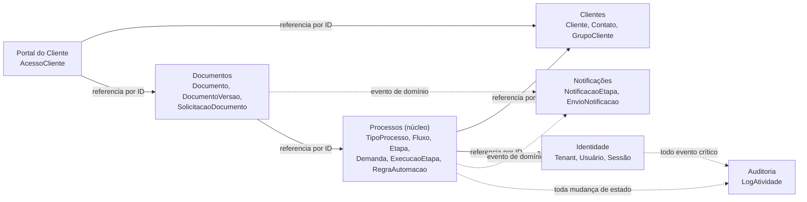

# Modelo de Domínio (DDD)

## 1. Bounded contexts

`Processos` é o **core domain** — onde está o diferencial competitivo do produto. Os demais são *supporting subdomains* (Clientes, Documentos) ou *generic subdomains* (Identidade, Auditoria, Notificações) que poderiam, em tese, ser substituídos por soluções de prateleira sem alterar a proposta de valor central.

## 2. Agregados do core domain (`Processos`)

### 2.1 Agregado `TipoProcesso`
**Raiz:** `TipoProcesso`. **Entidades internas:** `CampoPersonalizado`, `Fluxo` (que por sua vez agrega `Etapa`).

Invariantes protegidas pela raiz:
- Exatamente um `Fluxo` marcado como padrão por `TipoProcesso` a qualquer momento.
- `CampoPersonalizado.Ordem` é único dentro do tipo de processo.
- Uma `Etapa` do tipo `Uniao` só referencia `Etapa`s do tipo `Condicional` existentes no mesmo `TipoProcesso`.

### 2.2 Agregado `Demanda`
**Raiz:** `Demanda` (a instância de execução — nome de domínio interno de "processo em andamento"). **Entidades internas:** `ExecucaoEtapa` (que agrega `Comentario` e `Anexo`), `ValorCampoPersonalizado`.

Invariantes protegidas pela raiz:
- `EtapaAtual` é sempre uma etapa pertencente ao `FluxoAtivo` da demanda.
- Transição de etapa só ocorre através de `Demanda.Avancar(resultado)` — nunca por atribuição direta de `EtapaAtualId` a partir de fora do agregado.
- `Status = Concluido` é terminal: nenhuma nova `ExecucaoEtapa` pode ser criada após a conclusão (salvo reabertura explícita, que é uma transição de domínio própria, auditada).
- Subdemanda (criada por etapa de Subprocesso) mantém referência ao `DemandaPaiId`; campos personalizados do pai são acessíveis à subdemanda via `Application` layer (serviço de leitura compartilhado), nunca por acesso direto ao agregado pai a partir do agregado filho.

### 2.3 Agregado `RegraAutomacao`
**Raiz:** `RegraAutomacao` (trigger + condição + ação). Independente dos agregados acima — referencia `TipoProcessoId` por ID, avaliado por um serviço de domínio (`AvaliadorDeRegras`) que roda fora da transação HTTP (worker), lendo o estado necessário via `Application` queries.

## 3. Linguagem ubíqua (glossário)

| Termo | Definição |
|---|---|
| **Tenant** | Um escritório contábil cliente do Processa; unidade de isolamento de dados |
| **Tipo de Processo** | Template configurável que define como uma categoria de trabalho deve ser executada |
| **Fluxo** | Agrupamento linear e ordenado de etapas dentro de um tipo de processo |
| **Etapa** | Unidade de trabalho configurável dentro de um fluxo, com um dos 8 comportamentos (ver [requisitos, módulo 6](../01-requisitos/requisitos-funcionais.md#6-módulo-motor-de-processos--tipos-de-etapa)) |
| **Demanda** | Instância de execução de um Tipo de Processo — o "processo real" vinculado a um cliente, com responsável e histórico |
| **Execução de Etapa** | O registro de uma etapa específica sendo executada dentro de uma demanda específica, com temporização própria |
| **Responsável** | Usuário atualmente encarregado de uma demanda (pode mudar ao longo da execução) |
| **Card** | Representação visual de uma Demanda ou Execução de Etapa no board kanban |
| **Regra de Automação** | Configuração declarativa `trigger → condição → ação`, avaliada de forma assíncrona |
| **Central de Pendências** | Visão agregada de demandas por urgência de prazo |

Ver o modelo de dados físico completo em [`modelo-de-dados.md`](modelo-de-dados.md) e a máquina de estados em [`maquina-de-estados.md`](maquina-de-estados.md).
