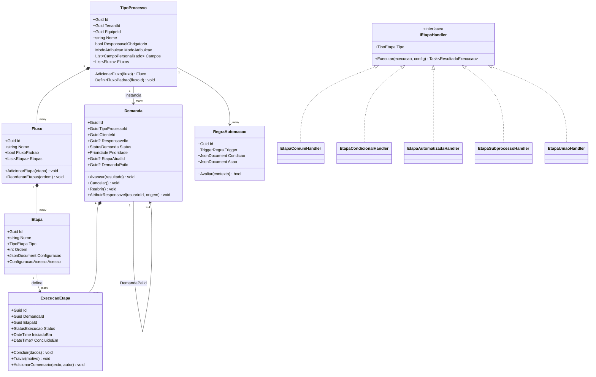
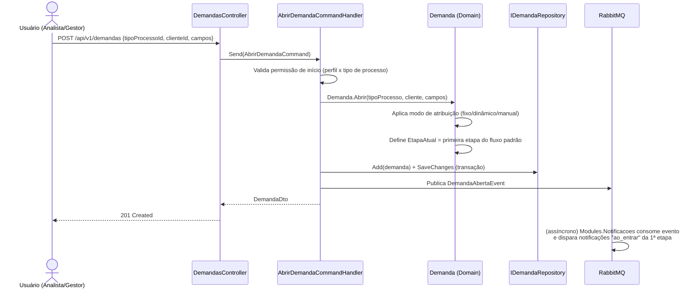
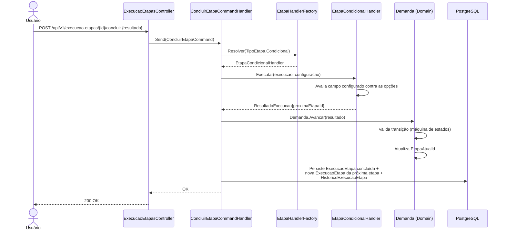
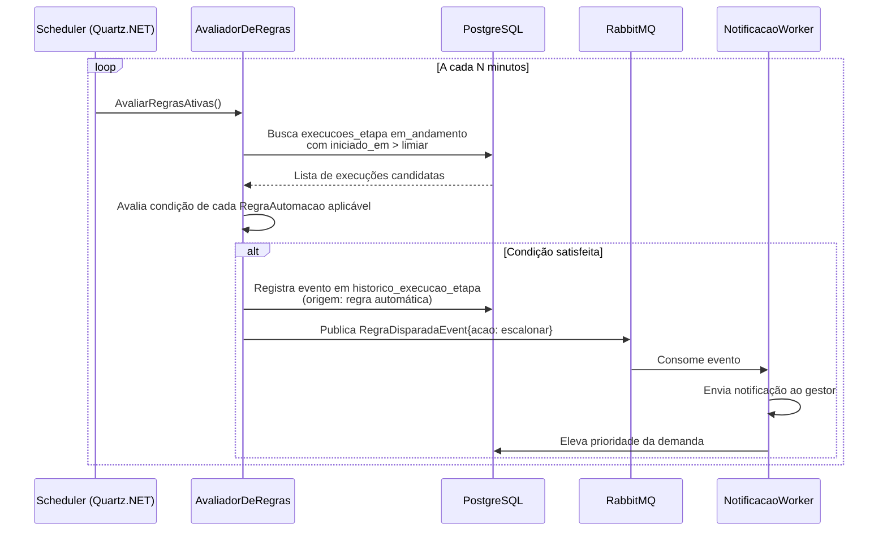

# Diagramas UML

Complementa o [modelo de domínio](../03-modelagem/modelo-de-dominio.md) com a visão de classes e as sequências dos fluxos mais críticos do motor de processos.

## 1. Diagrama de classes — núcleo do motor de processos

## 2. Sequência — abertura de demanda por formulário

## 3. Sequência — conclusão de etapa com desdobramento condicional

## 4. Sequência — motor de regras (escalonamento assíncrono)

Estes diagramas descrevem o comportamento *pretendido* do sistema (design antes da implementação) — servem como especificação para o desenvolvimento a partir do Sprint 3, conforme o [roadmap](../07-roadmap/roadmap-mvp.md).
