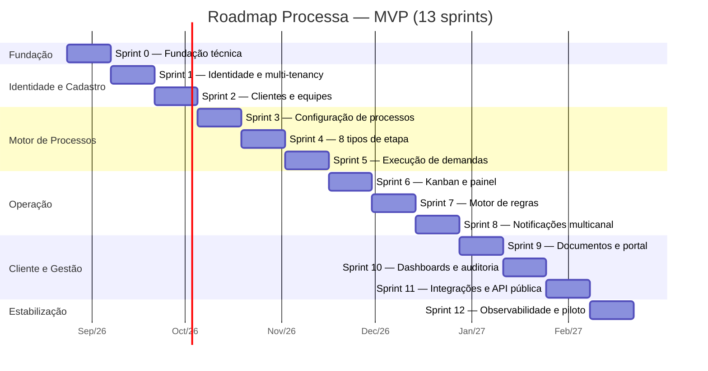

# Roadmap do MVP

13 sprints de 2 semanas (~26 semanas / 6 meses), do Sprint 0 (fundação) ao Sprint 12 (piloto). Espelha 1:1 o backlog rastreado no Jira (projeto `PROJ`, board Scrum) — ver [`backlog-sprints.md`](backlog-sprints.md) para o detalhamento story a story.

## Marcos (milestones)

| Marco | Ao final de | O que existe funcionando |
|---|---|---|
| **M1 — Fundação pronta** | Sprint 0 | Repositório, CI/CD, Docker Compose local, arquitetura validada por testes automáticos |
| **M2 — Multi-tenant operacional** | Sprint 2 | Um escritório se cadastra, cria equipes, cadastra clientes |
| **M3 — Motor de processos completo** | Sprint 5 | Fluxos configuráveis com os 8 tipos de etapa executando ponta a ponta |
| **M4 — Operação diária viável** | Sprint 8 | Kanban, regras de automação e notificações multicanal funcionando |
| **M5 — Produto fechado para cliente final** | Sprint 10 | Portal do cliente, documentos, dashboards e auditoria |
| **M6 — Pronto para piloto real** | Sprint 12 | Observabilidade, segurança revisada, API pública documentada |

## Critérios de saída do MVP

O MVP está pronto para o primeiro piloto real quando:
1. Um escritório consegue operar do zero — cadastro, equipe, cliente, tipo de processo, execução de uma demanda completa — sem intervenção de desenvolvedor.
2. Um cliente final consegue receber uma solicitação de documento e resolvê-la inteiramente pelo portal.
3. O checklist de segurança do [Sprint 12](../05-seguranca/politica-de-seguranca.md#8-checklist-de-revisão-de-segurança-pré-piloto) está 100% verificado.
4. Cobertura de testes ≥ 80% no backend (gate de CI, ver [ADR-010](../02-arquitetura/decisoes/adr-010-ci-cd-gitflow.md)).

## Pós-MVP (Fase 2 — não bloqueia o piloto)

- **IA assistiva** (resumo de pendências do cliente, sugestão de fluxo por texto, assistente de consulta em linguagem natural) — epic `E14` no backlog, deliberadamente fora do MVP para não atrasar a validação do core do produto com uma feature de custo/risco maior.
- **SLA avançado** — relatórios de tendência histórica de cumprimento de SLA por equipe/cliente/tipo de processo.
- **App mobile nativo** — avaliar depois de validado o uso via web responsivo no piloto.
- **Assinatura digital de documentos** — via integração com provedor especializado (ex: Clicksign, DocuSign), não implementação própria.
